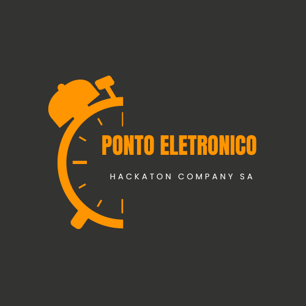

# Hackaton Company SA

A Hackaton Company SA, uma empresa de grande porte com mais de 100.000 colaboradores e que atende diversas áreas, inclusive tecnologia, está em um ponto de transição crucial.

## Ponto Eletronico

# Explicar a razao de usar microservicos #

### Desenho da pipeline 

#### Arquitetura 

-> Desenho
-> Explicacao

#### Como rodar a aplicação 

### Melhorias futuras 

### MVP 2 

#### Arquitetura 

-> Desenho 
-> Explicacao